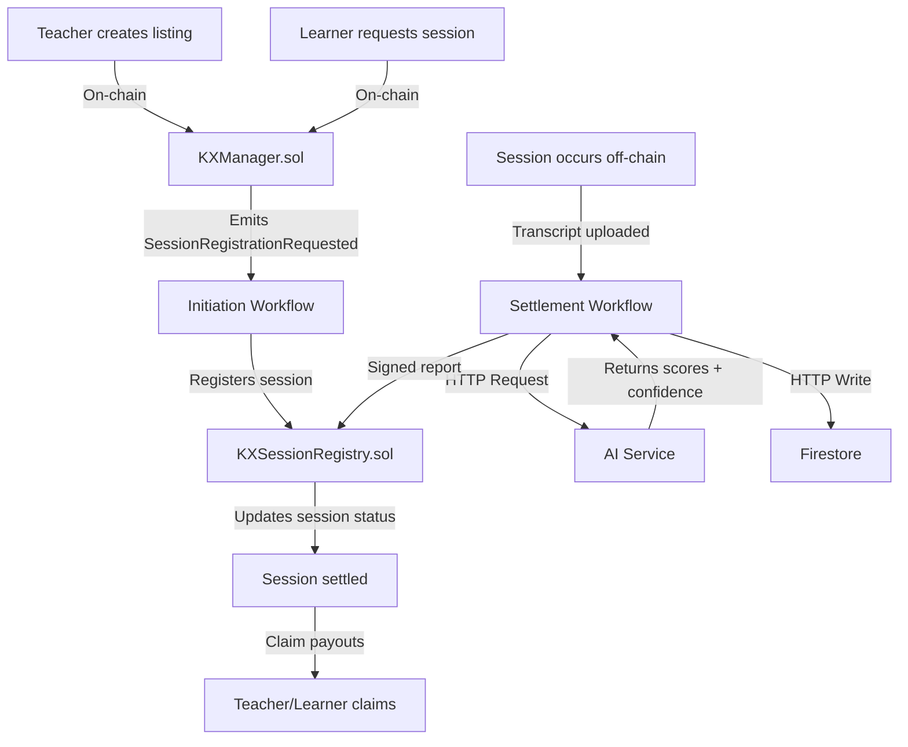
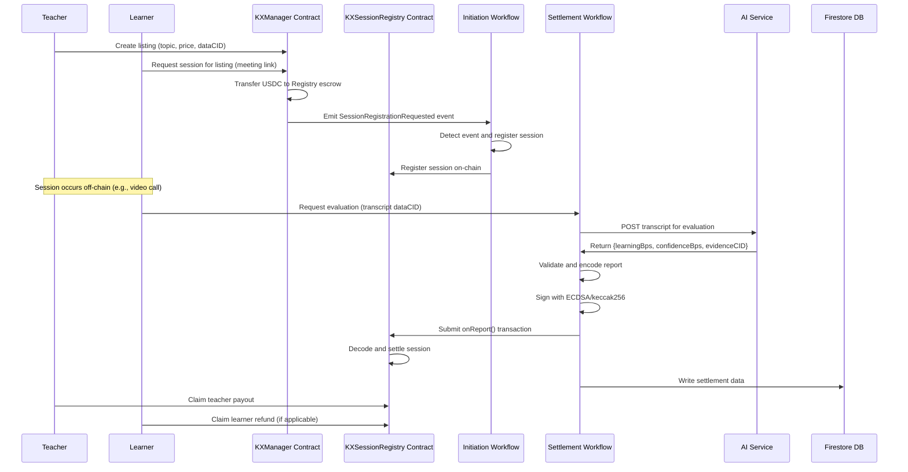

# Verity - Knowledge Exchange Platform

This repository demonstrates an end-to-end **decentralized knowledge exchange platform** using the **Chainlink Runtime Environment (CRE)** integrated with AI evaluation and Firebase for data persistence.

## Table of Contents

- [What This Project Does](#what-this-project-does)
- [Key Concepts](#key-concepts)
- [Repository Structure](#repository-structure)
- [How It Works](#how-it-works)
  - [Architecture Overview](#architecture-overview)
  - [Flow of Operations](#flow-of-operations)
- [Prerequisites](#prerequisites)
- [Quick Start](#quick-start)
  - [Option 1: Test CRE Workflows Only (Fastest)](#option-1-test-cre-workflows-only-fastest)
  - [Option 2: Full End-to-End Test](#option-2-full-end-to-end-test)
- [Security Considerations](#security-considerations)

## What This Project Does

Verity is a decentralized platform that connects teachers and learners for knowledge exchange sessions with fair, AI-powered evaluation and payouts:

1. **Teachers create listings** by offering to teach specific topics for a set price in USDC
2. **Learners browse listings** and request sessions, paying upfront into escrow
3. **Sessions occur off-chain** (e.g., video calls, meetings) - for our demonstration we use google meet with recall for fetching transcrpts
4. **We us AI to evaluate session quality** based on transcripts from the meeting and metadata
5. **Smart contracts distribute the payout** proportionally based on evaluation scores which weere generated by the ai. Teachers clam their payout and students claim the remainer of the amount.
6. **Settlement data is stored** on IPFS for audit and transparency

**Key Technologies:**
- **Smart Contracts**: Solidity contracts for listings, sessions, and escrow management
- **CRE**: Event-driven workflow orchestration for automation
- **AI Evaluation**: Automated quality assessment using Gemini (or any OpenAI-compatible AI)
- **IPFS based store**: all resources are stored publicly on ipfs for adit trail and data persistence

## Key Glosary

- **Listing**: A teacher's offer to provide knowledge on a specific topic. Includes a description (stored as dataCID), price in USDC, and the teacher's address + metadta.
- **Session**: A booked instance of a listing between a specific teacher and learner. Payments are held in escrow until evaluation.
- **Initiation Workflow**: is trigered when a learner requests a session for a listing, registering the session on-chain.
- **Settlement Workflow**: is triggered when a teacher claims that the metting has been completed and this evaluates the session transcript and settles payouts based on AI scores.

## Code Structure:

```
.
├── src/                    # Solidity contracts
│   ├── KX.sol              # KX token for payments
│   ├── KXManager.sol       # Manages listings and session requests
│   ├── KXSessionRegistry.sol # Handles sessions, escrow, and settlements
│   ├── tUSDC.sol           # Test USDC token
│   └── interfaces/         # Contract interfaces
├── workflows/              # CRE TypeScript workflows
│   ├── initiation-workflow/  # Registers sessions on-chain
│   ├── settlement-workflow/  # AI evaluation and settlement
│   └── shared/               # Shared utilities and types
├── test/                   # Contract tests
├── scripts/                # Deployment and interaction scripts
├── artifacts/              # Compiled contract artifacts
└── README.md              # This file
```

## How It Works

### Architecture Overview



### Flow of Operations



## Prerequisites

To run this project, you'll need:

- [Git](https://git-scm.com/book/en/v2/Getting-Started-Installing-Git)
- [Bun](https://bun.sh/) (JavaScript runtime and package manager)
- [Chainlink Runtime Environment CLI](https://docs.chain.link/)
- [AI API Key](https://aistudio.google.com/api-keys) (Gemini) or OpenAI-compatible API
- [Pinata kwt](https://console.firebase.google.com/)
- [ETH Sepolia funds](https://faucets.chain.link/) for gas
- [USDC on Sepolia](https://faucet.circle.com/) for session payments

## Quick Start

### Option 1: Test CRE Workflows Only (Fastest)

This option tests the workflows with pre-deployed contracts.

```bash
# 1 install deps
cd workflows/initiation-workflow
bun install
cd ../settlement-workflow
bun install

# 2. Set environment variables. Create .env file from example
cp .env.example .env

# Populate theseaccordingly credentials.

# 4. Run simulation for initiation workflow
cre workflow simulate initiation-workflow --target local-simulation

#txHash->0xce23ebdd2a5e03961ff706c2705891dc394e23a198acf469033f3bd768031452
#index->1

# 5. Run simulation for settlement workflow
cre workflow simulate settlement-workflow --target local-simulation

#txHash->0xbaf1c586927659019f697b5e666c31d1140cb054847a7b4c701c6607e22f056b
#index->0
```

**Environment Variables** (`.env`):
```bash
CRE_ETH_PRIVATE_KEY=0x...       # Private key with Sepolia ETH
CRE_TARGET=local-simulation
AI_API_KEY_VAR=...              # Gemini or OpenAI API key
FIREBASE_API_KEY_VAR=...        # From Firebase console
FIREBASE_PROJECT_ID_VAR=...     # From Firebase console
```

### Option 2: Full End-to-End Test

#### Method A: Abi Ninja

For quick testing without deploying, use [Abi Ninja](https://abi.ninja/) with the pre-deployed contracts from `definitions.gen.ts`.

1. **Get Contract Addresses and ABIs**:
   - USDC: `0xb243a36d2cb3937b40043050bf4f7d36795322db`
   - KXManager: `0x42c105b36825778ca323bf850df6e007b0407dca`
   - KXSessionRegistry: `0xB9f475C996A61c8BC9b2E72B7Df3de3017Dd3C76`
   - ABIs are available in `definitions.gen.ts`

2. **Connect to Sepolia**:
   - In Abi Ninja, select Ethereum Sepolia network
   - Connect your wallet with Sepolia ETH and USDC

3. **Test Key Functions**:
   - **Create Listing** (KXManager): Call `createListing` with a dataCID (e.g., "Qm...") and price (e.g., 1000000 for 1 USDC)
   - **Request Session** (KXManager): First approve USDC, then call `requestSessionRegistration` with listing index and meeting link
   - **View Sessions** (KXSessionRegistry): Call `getSession` with session ID to check status
   - **Request Evaluation** (KXSessionRegistry): Call `requestEvaluation` to trigger settlement workflow
   - **Claim Payouts** (KXSessionRegistry): Call `claimTeacher` or `claimLearner` after evaluation

4. **Monitor Events**:
   - Watch for `SessionRegistrationRequested`, `SessionEvaluated`, etc., in the contract's event logs

### Mthod B Frontend
@Ishtails

## Security Considerations

**⚠️ Important Notes:**

1. **This is a demo project** - Not audited or production-ready
2. **Never commit secrets** - Keep `.env` out of version control
3. **Test with small amounts** - Use testnet tokens only
4. **Verify AI responses** - AI evaluations may have biases or inaccuracies
5. **Monitor gas usage** - Workflow transactions consume gas from your account
6. **Off-chain sessions** - Quality depends on honest transcript submission
